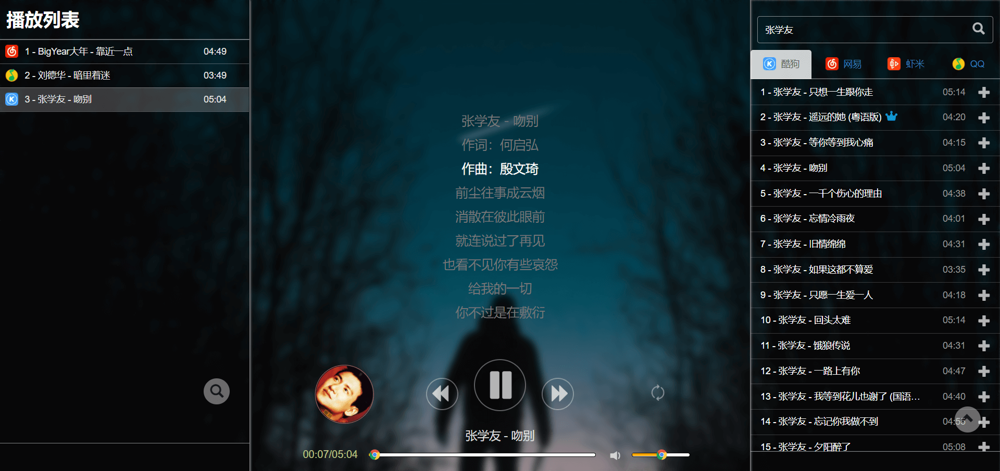

# haha-music
## 哈哈音乐播放器

将四大音乐平台（网易云、酷狗、QQ、虾米）的网页播放源整合成单个网页播放器。

**在线Demo地址**： [哈哈音乐](http://jaysonl.top/haha-music/)




------

### 🔨 安装部署

#### 准备项目

```bash
git clone https://github.com/jaysonlong/haha-music.git
cd haha-music
sudo docker network create haha-music
```

#### 使用 docker-compose (V2) 启动/停止

```bash
# 启动容器，监听80端口
sudo docker compose up -d

# 或指定监听端口
sudo PORT=8080 docker compose up -d

# 停止容器
sudo docker compose stop
```

#### 访问页面

浏览器访问 http://localhost